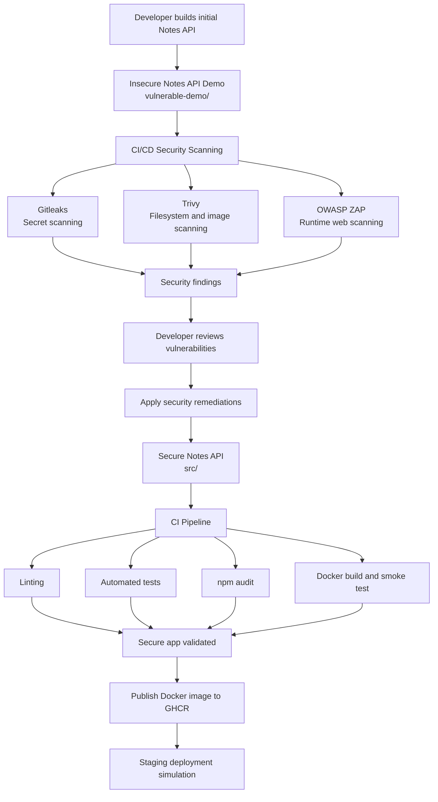

# Secure Notes API CI/CD Lab

[](https://github.com/hhoangsonnw/secure-notes-cicd/actions/workflows/ci.yml)
[](https://github.com/hhoangsonnw/secure-notes-cicd/actions/workflows/security.yml)
[](https://github.com/hhoangsonnw/secure-notes-cicd/actions/workflows/vulnerable-notes-security.yml)
[](https://github.com/hhoangsonnw/secure-notes-cicd/actions/workflows/publish-image.yml)
[](https://github.com/hhoangsonnw/secure-notes-cicd/actions/workflows/deploy-staging.yml)

A compact DevSecOps lab built around a Notes API.

This repo shows the same backend idea in two stages: an intentionally insecure first version and a remediated version that passes CI/CD, security scans, Docker smoke tests, and a staging deployment simulation.

## What Is Included

| App | Path | Purpose |
| --- | --- | --- |
| Secure Notes API | `src/` | The remediated API with authentication, authorization, validation, security headers, rate limiting, and Docker support. |
| Insecure Notes API Demo | `vulnerable-demo/` | A controlled vulnerable version used to demonstrate scanner findings and common secure coding mistakes. |

Do not deploy the vulnerable demo publicly. It intentionally includes plaintext password storage, hardcoded secrets, SQL injection, broken access control, XSS, insecure cookies, missing security headers, verbose error disclosure, and outdated dependencies.

## Tech Stack

| Area | Tools |
| --- | --- |
| API | Node.js, Express |
| Database | SQLite, better-sqlite3 |
| Auth | bcryptjs, jsonwebtoken |
| Security controls | Helmet, express-rate-limit |
| Security scanning | Gitleaks, Trivy, OWASP ZAP |
| Testing | Jest, Supertest |
| Documentation | OpenAPI, Swagger UI |
| Delivery | Docker, Docker Compose, GitHub Actions, GHCR |

## Features

- Register, log in, and manage private notes.
- Protect routes with JWT authentication.
- Scope every note query to the authenticated user.
- Hash passwords with bcrypt.
- Validate and normalize user and note input.
- Serve OpenAPI docs through Swagger UI.
- Build and run with Docker or Docker Compose.
- Run CI checks, security scans, image publishing, and staging smoke tests with GitHub Actions.

## Quick Start

### Prerequisites

- Node.js 20+
- npm
- Docker and Docker Compose

### Run the Secure API

```bash
npm install
cp .env.example .env
npm run dev
```

The secure API runs at `http://localhost:3000`.

```bash
curl http://localhost:3000/health
```

Swagger UI is available at:

```text
http://localhost:3000/api-docs
```

### Run the Insecure Demo

```bash
cd vulnerable-demo
npm install
npm start
```

The insecure demo runs at `http://localhost:4000`.

```text
http://localhost:4000/api-docs
```

## Configuration

Create `.env` from `.env.example` before running the secure API locally.

| Variable | Default | Description |
| --- | --- | --- |
| `PORT` | `3000` | Secure API port |
| `NODE_ENV` | `development` | Runtime environment |
| `JWT_SECRET` | Required | Secret used to sign JWTs |
| `JWT_EXPIRES_IN` | `1h` | JWT expiration time |
| `DB_FILE` | `./data/secure_notes.sqlite` | SQLite database path |

## Usage

Authenticated requests use a bearer token:

```http
Authorization: Bearer <token>
```

Main secure API endpoints:

| Method | Endpoint | Auth | Description |
| --- | --- | --- | --- |
| `GET` | `/health` | No | Health check |
| `GET` | `/api-docs` | No | Swagger UI |
| `GET` | `/openapi.json` | No | OpenAPI spec |
| `POST` | `/api/auth/register` | No | Create a user |
| `POST` | `/api/auth/login` | No | Log in and receive a JWT |
| `GET` | `/api/auth/me` | Yes | Get the current user |
| `POST` | `/api/notes` | Yes | Create a note |
| `GET` | `/api/notes` | Yes | List your notes |
| `GET` | `/api/notes/:id` | Yes | Get one note |
| `PUT` | `/api/notes/:id` | Yes | Update one note |
| `DELETE` | `/api/notes/:id` | Yes | Delete one note |

The insecure demo exposes similar API routes plus endpoints for SQL injection, reflected XSS, stored XSS, insecure cookies, and debug data exposure. See `vulnerable-demo/README.md` or `http://localhost:4000/api-docs` for the demo details.

## Development Commands

```bash
npm test          # Run tests
npm run lint      # Run ESLint
npm run audit     # Check high-severity npm advisories
npm run check     # Run lint and tests
```

## Docker

Run the secure API with Docker Compose:

```bash
docker compose up -d --build
curl http://localhost:3000/health
docker compose down
```

Build and run the secure image manually:

```bash
docker build -t secure-notes-api:local .

docker run --rm -p 3000:3000 \
  -e JWT_SECRET=local-docker-dev-secret-change-me \
  -e JWT_EXPIRES_IN=1h \
  -e DB_FILE=/app/data/local_secure_notes.sqlite \
  secure-notes-api:local
```

Build and run the insecure demo image:

```bash
docker build -t insecure-notes-demo:local ./vulnerable-demo
docker run --rm -p 4000:4000 insecure-notes-demo:local
```

## Published Image

The secure API is published to GitHub Container Registry:

```text
ghcr.io/hhoangsonnw/secure-notes-api:latest
ghcr.io/hhoangsonnw/secure-notes-api:sha-<short-sha>
```

Run the latest image:

```bash
docker pull ghcr.io/hhoangsonnw/secure-notes-api:latest

docker run --rm -p 3000:3000 \
  -e JWT_SECRET=local-ghcr-test-secret \
  -e JWT_EXPIRES_IN=1h \
  -e DB_FILE=/app/data/local_ghcr_test.sqlite \
  ghcr.io/hhoangsonnw/secure-notes-api:latest
```

## CI/CD and Security

| Workflow | What it does |
| --- | --- |
| `ci.yml` | Lints, tests, audits dependencies, builds Docker image, and runs a smoke test. |
| `security.yml` | Runs Gitleaks, Trivy filesystem/image scans, and OWASP ZAP baseline scan on the secure API. |
| `vulnerable-notes-security.yml` | Scans the insecure demo with Gitleaks, Trivy, and OWASP ZAP full scan. |
| `publish-image.yml` | Builds and publishes the secure API image to GHCR. |
| `deploy-staging.yml` | Pulls the published image and runs staging health/API smoke tests. |

Pipeline flow:

```text
push or pull request
  -> lint, tests, audit
  -> Docker build and smoke test
  -> security scans
  -> publish image on main
  -> staging simulation
```

Security tooling is useful, but it is not a complete review. This project also highlights issues such as IDOR and broken access control, which often need targeted tests or manual review because generic scanners may miss business logic flaws.

## Insecure vs Secure

| Area | Insecure demo | Secure API |
| --- | --- | --- |
| Passwords | Plaintext | bcrypt hashes |
| JWT secret | Hardcoded | Environment variable |
| SQL | String concatenation | Prepared statements |
| Authorization | Missing ownership checks | Notes scoped by `user_id` |
| Validation | Weak or missing | User and note validation |
| Security headers | Missing | Helmet enabled |
| Rate limiting | Missing | express-rate-limit enabled |
| Errors | Verbose database errors | Safer generic errors |
| XSS | Raw HTML rendering | JSON API responses |
| Dependencies | Intentionally outdated | Audited dependencies |

## Project Structure

```text
src/                         # Secure API
  app.js
  server.js
  db/database.js
  docs/openapi.js
  middleware/auth.middleware.js
  routes/
  utils/

vulnerable-demo/             # Intentionally insecure demo API
  src/
  Dockerfile
  package.json

tests/                       # Jest and Supertest coverage
.github/workflows/           # CI/CD and security workflows
Dockerfile
docker-compose.yml
```

## Project WorkFlow



## Contributing

Issues and pull requests are welcome. Keep changes focused, run `npm run check`, and avoid committing real secrets or local database files.

For changes under `vulnerable-demo/`, keep the intent clear: vulnerabilities should be controlled, documented, and safe to run locally.

## License

MIT
